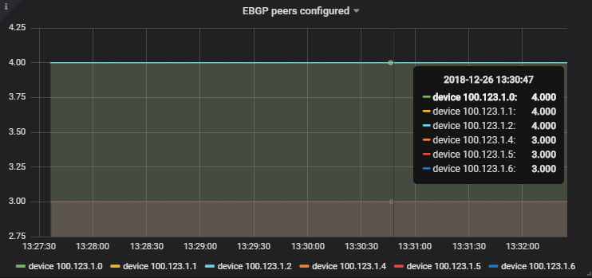
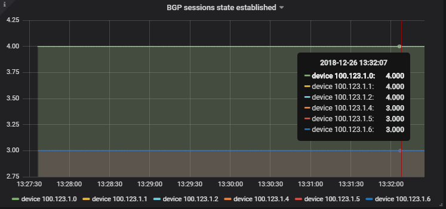
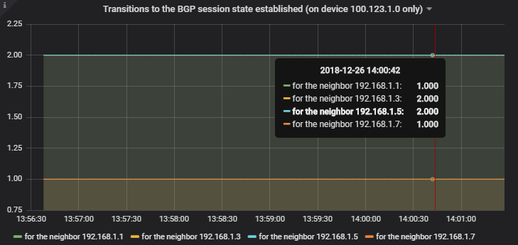
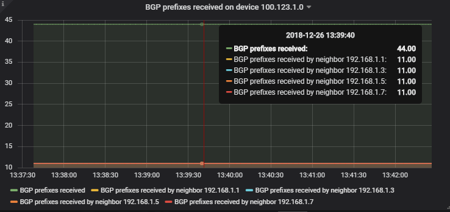
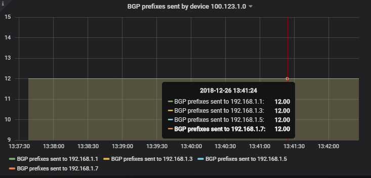

This repository provides instructions about how to monitor Junos devices using a TIG stack (Telegraf-Influxdb-Grafana).  
It currently supports data collection on Junos using SNMP and OpenConfig.

Please visit the [**wiki**](https://github.com/ksator/junos_monitoring_with_a_TIG_stack/wiki) for detailled instructions.  

Here are some Grafana screenshots, with data collected using Openconfig telemetry (GRPC) on Junos devices:

